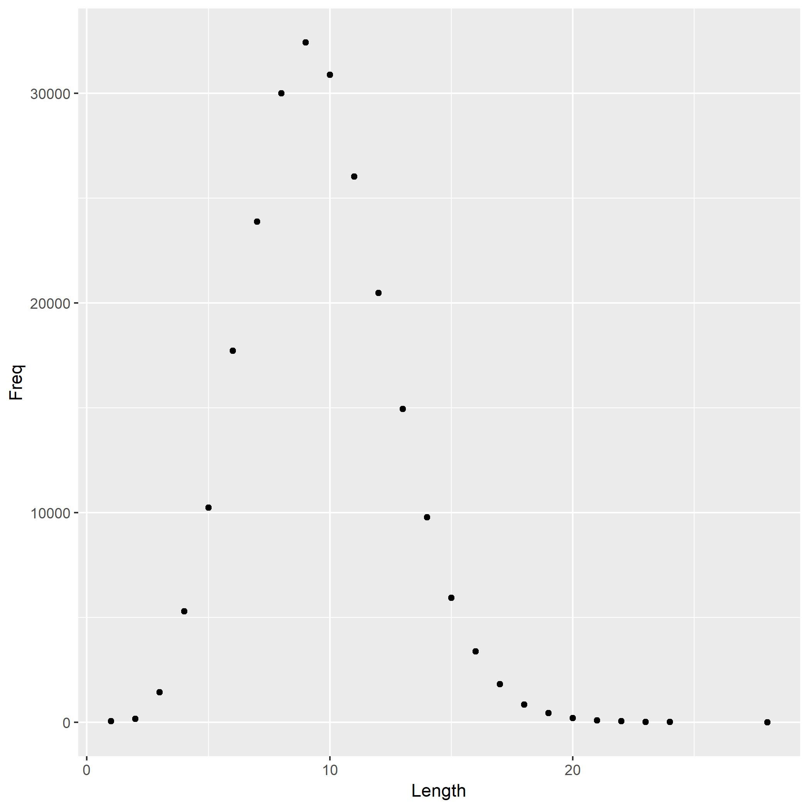

## Length of English Words

I computed the length of each word, i.e. the number of characters, and tabulated how many words consist of 1 character, 2 characters, etc.

The most frequent word length is 9.

Here is a histogram of word lengths.

## Frequency of the first letter

What is the most frequent first letter among all English words? How about the least one?

I made a plot here, which shows the most frequent first letter is S, and the lesat frequent one is X.

## Frequency of the consecutive letters

What is the most frequent letter after A among all the English words? How about the most frequent letter after B? How about C and etc ? 

I made a dataframe which shows the frequency of each letter after A to Z. Here, I made three plots, showing the results for A, B and C.

The plots above seems that the most frequent letter after A is N, the least frequent letter is A;

the most frequent letter after B is L, the least frequent letter is Z;

the most frequent letter after C is O, the least frequent letter is F;

